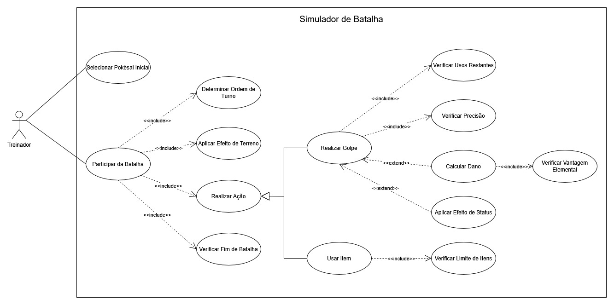
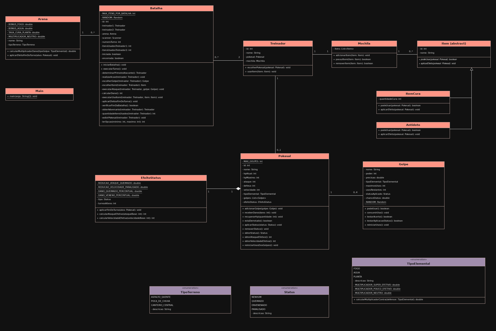

# Pokésal — Simulador de Batalha

Este é um projeto acadêmico desenvolvido em Java para colocar em prática orientação a objetos, modelagem UML e regras de negócio. A partida acontece pelo console, com os dois jogadores usando o mesmo terminal.

## Como funciona a partida

Cada treinador informa seu nome e escolhe **um único Pokésal**. Depois, os jogadores escolhem o terreno da arena e a batalha começa. A cada ação, é possível atacar ou usar um item da mochila. A partida termina quando um dos Pokésal fica sem HP.

Os seis iniciais estão divididos em dois grupos:

| Grupo | Planta | Fogo | Água |
| --- | --- | --- | --- |
| 1 | BulbaSal | CharSal | SquirtSal |
| 2 | ChikoSal | CyndaSal | TotoSal |

Cada Pokésal tem HP (vida), ATK (ataque), DEF (defesa), SPD (velocidade) e um tipo elemental.

### Vantagens elementais

O tipo do golpe é comparado com o tipo do defensor para definir o multiplicador de dano:

| Tipo do golpe | Contra Fogo | Contra Água | Contra Planta |
| --- | --- | --- | --- |
| Fogo | ×1,0 | ×0,5 | ×2,0 |
| Água | ×2,0 | ×1,0 | ×0,5 |
| Planta | ×0,5 | ×2,0 | ×1,0 |

### O terreno também conta

| Arena | Efeito |
| --- | --- |
| Asfalto Quente | Golpes de Fogo causam 15% a mais de dano. |
| Poça de Chuva / Piso Escorregadio | Golpes de Água causam 10% a mais de dano. |
| Canteiro Central | Pokésal de Planta recuperam 5% do HP máximo ao final do turno. |

Para a Poça de Chuva, escolhemos implementar o bônus no **dano**, uma das opções previstas no enunciado. A cura respeita o HP máximo e não recupera um Pokésal já derrotado.

### Turnos e efeitos de status

Quem tiver a maior velocidade efetiva age primeiro. Se as velocidades forem iguais, o desempate é aleatório. Se um Pokésal for derrotado durante uma ação, a batalha termina sem esperar o restante do turno.

Os golpes também podem aplicar efeitos de status:

- **Queimado:** reduz o ataque pela metade e causa dano ao final do turno.
- **Envenenado:** causa dano ao final do turno. Na versão atual, esse dano é de 12,5% do HP máximo por turno.
- **Paralisado:** reduz a velocidade pela metade, influenciando a ordem das ações.

Enquanto a batalha continuar, os efeitos de terreno e o dano de status são aplicados ao final de cada turno.

### Mochila

Cada treinador começa com uma Potion, uma Super Potion e um Antidote. As poções recuperam, respectivamente, 20 e 40 pontos de HP; o Antidote remove o status aplicado ao Pokésal.

O limite é de **dois itens por treinador em cada batalha**. Usar um item ocupa a ação daquele treinador no turno, e o item utilizado é retirado da mochila.

## Os três requisitos criados pela equipe

Além das regras propostas para o trabalho, acrescentamos:

1. **Até quatro golpes por Pokésal.** Cada inicial já começa com quatro opções de ataque.
2. **Precisão importa.** Se um golpe falhar no teste de precisão, ele não causa dano.
3. **Golpes têm usos limitados.** Cada golpe possui uma quantidade máxima de utilizações. Uma tentativa consome um uso mesmo quando erra, e golpes esgotados não podem ser escolhidos.

## Como executar

Você precisa do **JDK 21 ou superior**. O projeto usa apenas a biblioteca padrão do Java e não depende de Maven ou Gradle.

Clone o repositório e entre na pasta:

```bash
git clone https://github.com/eduardoaguiarc/Simulador-de-Batalha---PokeSal.git
cd Simulador-de-Batalha---PokeSal
```

### Pelo IntelliJ IDEA

1. Abra a pasta do projeto.
2. Selecione o JDK 21 ou superior como SDK do projeto.
3. Execute o método `main` de [`Main.java`](src/br/edu/ucsal/pokesal/app/Main.java).
4. Siga as opções exibidas no console.

### Pelo terminal

No **Windows, com PowerShell**:

```powershell
New-Item -ItemType Directory -Force out/classes | Out-Null
$fontes = Get-ChildItem src -Recurse -Filter *.java | ForEach-Object { $_.FullName }
javac --release 21 -encoding UTF-8 -d out/classes $fontes
java -cp out/classes br.edu.ucsal.pokesal.app.Main
```

No **Linux ou macOS**:

```bash
mkdir -p out/classes
find src -name '*.java' > out/fontes.txt
javac --release 21 -encoding UTF-8 -d out/classes @out/fontes.txt
java -cp out/classes br.edu.ucsal.pokesal.app.Main
```

## Organização do código

Os pacotes ficam em `src/br/edu/ucsal/pokesal`:

| Pacote | Responsabilidade |
| --- | --- |
| `app` | Entrada do programa, cadastro dos treinadores e escolhas iniciais. |
| `arena` | Terrenos e seus efeitos na batalha. |
| `batalha` | Ordem dos turnos, ações, cálculo de dano e resultado da partida. |
| `enums` | Tipos elementais, terrenos e status. |
| `item` | Itens de cura e remoção de status. |
| `pokesal` | Atributos dos Pokésal, golpes e efeitos de status. |
| `treinador` | Treinadores e suas mochilas. |

## Diagramas

Estes são os diagramas usados na modelagem do projeto:

### Casos de uso



### Classes



## Qualidade do código e próximos passos

Os 14 arquivos Java foram revisados com **Checkstyle 14.1.0**, usando **Google Checks**, sem avisos ou erros na verificação. A configuração do plugin CheckStyle-IDEA está incluída em [`.idea/checkstyle-idea.xml`](.idea/checkstyle-idea.xml). Para conferir pelo IntelliJ, use essa versão do Checkstyle e execute a análise de todos os arquivos Java com Google Checks.
